# Dougie 产品需求文档（PRD）— 执行验收基线

| 项目 | 内容 |
|---|---|
| 文档版本 | V2.1.11（V2.1.10 整合版 + 决策 #21 修订：意图主路径改为 ONNX 中文编码器） |
| 来源文档 | `source/Waku-Android_Local-First-Agent_PRD_v2.0.md`（V2.0.0 主干）+ `source/Waku-Android_PRD_V2.0_Feasibility_Review.md`（可行性评审修正）+ `source/prd.md`（V1.0.0，仅作背景） |
| 整合策略 | V2.0 主干 + 吸收可行性评审全部修正；V1.0 仅作背景与演进记录 |
| 日期 | 2026-08-21 |
| 状态 | 执行验收基线 |
| 平台 | Android 10+，首期重点适配 Android 13–16 |
| 产品形态 | Android 原生 App + Agent Runtime |
| 核心理念 | Local-first / Permission-first / Tool-driven / Recoverable |
| 首期目标 | 完成一个可稳定运行的本地优先移动 Agent MVP |
| MVP 总工期 | 8–12 周（2–3 人 Android 团队，含 20% OEM 兼容性预算） |

---

# 1. 文档说明与演进背景

## 1.1 文档说明

本文档整合自 `source/` 目录下三份文档：

1. **V2.0 可执行 PRD**（`Waku-Android_Local-First-Agent_PRD_v2.0.md`）：本文档的权威主干，将原方案从"架构设计方向"升级为"可以进入 PoC → MVP → Beta 开发"的 PRD。
2. **可行性审核报告**（`Waku-Android_PRD_V2.0_Feasibility_Review.md`）：审核结论 B+（可行，但需调整预期）。其全部修正建议已吸收进本文档对应章节，包括工期重估（8–12 周）、Semantic Memory MVP 降级、幂等前置、可靠性验收边界修正、OEM 兼容预算、测试优先级等。
3. **V1.0 原 PRD**（`source/prd.md`）：仅作为背景与演进记录素材，其被 V2.0 修正的主张（绝对化隐私承诺、MAX_LOOPS=10、WorkManager 断点续传等）不作为本文档的执行依据。

> 重要原则：原 PRD 中"所有数据绝不离开设备"的目标与"支持 Cloud LLM"存在天然冲突。本文档将其修正为"Local-first + Explicit Data Egress"：默认本地保存；任何发送到云端的数据必须经过明确的数据出境策略。

## 1.2 背景与痛点（源自 V1.0）

当前大部分 Mobile Agent 依赖云端 SaaS 框架（如 LangChain/LlamaIndex 服务端），存在以下突出问题：

1. **隐私泄露风险**：用户敏感数据（如聊天记录、日程、通讯录、位置）需要频繁上传云端。
2. **上下文感知弱**：桌面或云端 Agent 难以实时感知用户的移动端设备状态（传感器、通知、应用互操作）。
3. **框架过于臃肿**：传统 Agent 框架封装层级过深，难以在 Android 端进行低延迟、高灵活度的定制开发。

## 1.3 解决方案概述

借鉴 **Waku-Agent** 的设计理念——**Local-first（本地优先）** 与 **极简推理循环（KISS Loop）**，构建运行于 Android 客户端的原生 Agent 引擎。将 Agent 的四大柱石（Harness/Gateway、Loop Engine、Memory Architecture、Tools）完整映射并落地到 Android 原生技术栈。

## 1.4 演进记录

### V1.0 → V2.0 的关键修正（6 项）

| 原问题 | V1.0 主张 | 修正后主张 | 原因 |
|---|---|---|---|
| 目标过于绝对 | "隐私绝对安全" | Local-first + Explicit Data Egress | 只要支持 Cloud LLM，就无法保证所有数据永不离开设备 |
| Loop 只有流程，没有可靠性 | 仅状态循环 | 增加 Task / Timeout / Retry / Cancel / Recovery / Idempotency | 流程无法支撑真实设备上的任务可靠性 |
| Tool 只有功能列表 | 仅有 Tool 清单 | 增加 Schema / Permission / Risk Level / Policy / Confirmation / Audit / Idempotency | Tool 是真实系统副作用入口，必须治理 |
| Memory 只有存储，没有治理 | 仅存储层 | 增加 Source / Confidence / Expiration / Delete / User Control / Sensitive Filter | 用户必须知道 Agent 记住了什么、从哪里来 |
| WorkManager 定位过度 | WorkManager + 断点续传 | WorkManager 是后台任务调度器，而非无限后台 Agent Runtime | Android 系统限制决定 |
| Accessibility 过早进入 MVP | MVP 包含无障碍自动化 | 移至 Beta，避免第一阶段被系统行为、厂商差异和安全策略拖慢 | 稳定性与 Play 政策风险高 |

### V2.0 → V2.1（本整合版）吸收的评审修正（13 项）

| # | 修正项 | 落点章节 |
|---|---|---|
| 1 | 增加 ANR 防护：Loop Engine 运行在自定义 `CoroutineDispatcher`，UI 层仅收集 `StateFlow` | §5.5 |
| 2 | 工期重估：MVP 总工期 8–12 周（原隐含 5–8 周），分阶段采用现实估算 | §15、§18 |
| 3 | Phase 1 拆分为两个子阶段（Non-streaming + 1 Tool → Streaming + 多 Tool） | §15 |
| 4 | Phase 4 不作为"1 周收尾"，而是贯穿全程的质量基线 | §15、§16 |
| 5 | Semantic Memory MVP 降级：FTS5 全文检索 + 关键词匹配，向量检索进 Beta | §3、§7 |
| 6 | Token 计数需本地实现，采用统一最坏情况估算（1 token ≈ 0.75 个汉字 / 0.25 个英文单词），接近 Budget 优先截断 Tool Result | §8.3 |
| 7 | Process Death Recovery 边界：Task 状态可恢复、Tool 副作用可幂等，不恢复 LLM 流 | §5.6、§16.5 |
| 8 | 补充 Google Play 政策：Accessibility 审核严格（需视频演示、不得自动化点击第三方 App）；前台 Service 需声明 `foregroundServiceType`（Android 14+ 更严） | §10.2、§10.3 |
| 9 | 剪贴板 Tool 仅在前台激活时可用（Android 12+ `READ_CLIPBOARD` 隐私指示器） | §6.6 |
| 10 | Release 构建必须关闭所有 LLM 原始响应日志输出 | §9.3 |
| 11 | 增加 `ToolCallSanitizer` 层：Schema Validate 之前做参数类型强制转换与默认值填充 | §6.4 |
| 12 | 明确测试优先级（P0/P1/P2），P0 必须完成、P2 可用手动清单替代 | §14.2 |
| 13 | 预留 20% 工期处理 OEM（三星/小米/华为等）厂商特定权限行为与后台限制 | §10.4、§15 |

### V2.1 追加决策（1 项）

| # | 决策 | 内容 | 落点章节 |
|---|---|---|---|
| 14 | 新增 `:cli` 开发工具模块 | 基于 mosaic（JakeWharton，Compose Runtime + JLine 3）实现 JVM-only Agent Console，复用 `:core:*` 模块，用于状态机可视化验证与日常调试；手机端"终端风"主题用 Compose UI 自绘实现，与 mosaic 无关（mosaic 无法运行在 Android） | §3.1、§15、§17.3、§18 |

### V2.1 追加决策（2 项：屏幕感知与操作能力）

| # | 决策 | 内容 | 落点章节 |
|---|---|---|---|
| 15 | 引入屏幕感知能力（参考 FGA） | 参考 FGA（Fate-Grand-Automata，MIT 协议：MediaProjection 截图 + OpenCV 模板匹配 + Accessibility 操作）拆分引入：**MVP（Phase 3）只做感知**——`ScreenCaptureTool`（MediaProjection 截图，风险 L1）+ `ScreenMatchTool`（OpenCV 模板匹配，风险 L0，read-only 断言）；**Accessibility 点击/滑动（`TapSwipeTool`，风险 L3）维持 Beta/侧载变体**（Play 分发下不得自动化点击第三方 App） | §3.1、§6.7、§10.2、§15、§17.1、§18 |
| 16 | 分发渠道默认 Play 合规路径 | PRD 未正式登记分发渠道，但多处 Play 政策约束隐含默认；本决策固化默认：MVP 走 Google Play 合规路径（仅感知能力），`TapSwipeTool` 作为 Beta 侧载变体发布（与 Play 版本隔离）；侧载渠道是否正式启用由产品在 Beta 前置阶段拍板（该开放项已由决策 #17 关闭：双渠道启用，见 §17.4） | §6.7、§10.2 |

### V2.1 追加决策（1 项：构建期多渠道打包）

| # | 决策 | 内容 | 落点章节 |
|---|---|---|---|
| 17 | 构建期多渠道打包（已拍板启用双渠道） | 双渠道产品形态：**play 包**（上架应用市场，无 Accessibility 功能，面向轻度用户下载宣传）与 **sideload 包**（侧载发布，含 `TapSwipeTool`，用户手动赋予权限并默认完全知情，面向重度用户）。差异在**构建期**通过 Gradle product flavors 固化（AccessibilityService 必须在 manifest 静态声明，运行时无法动态注册/解锁，故不做运行时切换） | §6.7、§10.2、§17.4、§18 |

### V2.1 追加决策（1 项：桌面端长期规划）

| # | 决策 | 内容 | 落点章节 |
|---|---|---|---|
| 18 | 桌面端列入长期规划（优先级后置） | 桌面端作为长期规划方向，但开发优先级明确**后置**：先完成 Android 端（play + sideload）发布并稳定，`:cli` 发布并稳定后，再启动桌面端开发。MVP / Beta 阶段均不包含桌面端；桌面端复用 `:core:*` JVM 纯净架构（Agent Runtime 直接复用），平台层（桌面 UI / 桌面 Tool 适配 / 数据库跨平台迁移）届时新增 | §3.2、§15、§17.2 |

### V2.1 追加决策（1 项：离线中文 ASR）

| # | 决策 | 内容 | 落点章节 |
|---|---|---|---|
| 19 | 离线中文 ASR（语音输入，Paraformer-zh 主选） | 基于 sherpa-onnx（官方支持 Android 完全离线推理）引入离线中文语音识别作为 Agent 语音输入：**主选 Paraformer-zh**（int8，中文识别精度顶级）；**SenseVoiceSmall 作为备选**——若 Paraformer-zh 实机效果未达验收标准则切换启用（int8，支持多语言与情感/事件检测）。模型部署**按渠道区分**：play 包不内置模型（保持轻量，首次使用按需下载至私有目录），sideload 包内置模型（重度用户一次到位）；详见 §6.8 | §3.1、§6.8、§15、§17.1、§18 |

### V2.1 追加决策（1 项：离线 TTS）

| # | 决策 | 内容 | 落点章节 |
|---|---|---|---|
| 20 | 离线 TTS（语音输出，sherpa-onnx VITS 系为主，系统 TTS 仅降级） | 实现 Agent 语音输出并与 ASR（决策 #19）形成**离线语音闭环**。方案对比（包体/性能/音色多样性）后推荐：**主选 sherpa-onnx VITS 系离线 TTS**（推荐 `vits-zh-hf-fanchen-C` 187 音色 ~116MB，备选 `theresa/eula` 804 音色、`zh-ll` 5 音色小包体、`Kokoro` 音色自然度优先但 RTF 高需评估）；**Android 原生 TextToSpeech 仅作降级回退**（play 包模型未就绪时的临时播报），不作主方案（中文音色 1–2 个不可控、OEM 差异大、在线引擎有数据出境风险）。部署与 ASR 同策略：play 包按需下载 / sideload 包内置；详见 §6.9 | §3.1、§6.9、§15、§17.1、§18 |

### V2.1 追加决策（1 项：本地意图理解）

| # | 决策 | 内容 | 落点章节 |
|---|---|---|---|
| 21 | 本地意图理解 Tool（ONNX 中文编码器） | 为 Agent 增加手机端中文意图理解能力：**`IntentClassifierTool`** 对封闭意图标签做 **一次前向分类**，不跑自回归 LLM。**主选**：中文小编码器（MiniRBT 量级）+ 在自建意图集上微调的分类头，导出 ONNX；推理复用 ASR/TTS 已有的 **ONNX Runtime**（`libonnxruntime.so`，CPU / XNNPACK / NNAPI）。输出仍为结构化 JSON（意图 / 槽位 / 路由 / 置信度）。槽位 MVP 用规则抽取；复杂槽位低置信时澄清或 Cloud LLM。**SmolLM2 排除**（英文为主）。**Qwen3-0.6B GGUF + llama.cpp / 其它端侧生成式 LLM** 不作本 Tool 主路径（见 §6.10 历史方案）。独立**可选下载**（约 10–20MB），不计入语音预算（规则 A）；与 ASR 构成离线语音意图闭环。归 Phase 5 Beta；详见 §6.10 | §3.1、§6.10、§15、§17.1、§18 |

### V2.1.11 修订（决策 #21）

V2.1.10 将意图主路径定为 Qwen3-0.6B-Instruct GGUF + llama.cpp（thinking/non-thinking、Q8 ≈639MB / Q4 ≈420–470MB）。真机上 llama.cpp Vulkan 无法稳定逐 token 生成，CPU 自回归达不到规则 E 的 P95 ≤ 500ms；该路径与「本 Tool 是路由器、MVP 不做完整端侧 LLM 产品化」冲突。**V2.1.11 起以 ONNX 编码器分类为主路径**（上表）。Qwen3-0.6B GGUF、Qwen2.5-0.5B GGUF、llama.cpp JNI 均降为历史方案，不再作为实现与验收依据。

### V2.1 追加决策（1 项：关键用户流程 / UI 规范 / 技术方案补全）

| # | 决策 | 说明 | 影响章节 |
|---|---|---|---|
| 22 | 补全关键用户流程、UI 规范与技术方案 | 在既有架构之上补全三块可执行文档：①**关键用户流程**（§4.4，6 个端到端流程 UF-01–UF-06，Mermaid 图，映射 E2E Case）；②**UI 规范**（§11.4–§11.8，Material Design 3 完整设计规范——设计令牌/组件/交互/动效/布局）；③**技术方案**（§20，接口契约级——5 个核心接口 Kotlin 契约、模块依赖图、错误映射表、4 个数据流图）。配套新增 Case 13/14（E2E 共 14 个）与 2 项 DoD；技术方案遵循 :core:* JVM 纯净与 §17.2 模块红线 | §4.4、§11.4–§11.8、§16、§20 |

---

# 2. 产品定位

## 2.1 产品一句话

Dougie 是一个运行在 Android 手机上的 Local-first Agent Runtime，使 Agent 可以在本地理解用户上下文、检索本地记忆、调用 Android Native Tools，并在获得授权后使用云端或端侧 LLM 完成复杂任务。

## 2.2 核心价值

### MVP 必须证明四件事

1. Agent Loop 可以稳定运行。
2. Agent 可以使用 Android Tool 完成真实任务。
3. Memory 可以被可靠写入、检索和恢复。
4. App 被杀死、网络中断或 Tool 失败后，任务不会出现不可控状态。

## 2.3 产品原则

| 原则 | 要求 |
|---|---|
| Local-first | 控制流、Memory、Tool Registry、权限状态默认在本地 |
| Permission-first | 敏感操作必须经过权限与策略检查 |
| Explicit Egress | 发送到云端前明确知道发送了什么 |
| Tool-driven | Agent 不直接修改系统状态，只能通过 Tool |
| Recoverable | 每个任务必须能够恢复、取消或进入失败态 |
| Observable | 每次 Tool 调用、错误、耗时可追踪 |
| Minimal Core | Core Loop 保持简单，复杂能力放在模块边界 |

---

# 3. MVP 范围与非目标

## 3.1 MVP 必做

### Agent Core

- ReAct/Tool Loop
- StateFlow 状态管理
- 最大 Loop 次数
- 单次 Tool Timeout
- 全局 Task Timeout
- Cancel
- Retry
- Error State
- Task Persistence
- Task Recovery

### LLM

- OpenAI-compatible Provider
- 一个默认 Cloud Provider
- Streaming
- Non-streaming
- Tool Calling
- Token/Context Budget
- Provider 超时与错误处理

### Memory

- Conversation Memory
- FTS5
- Semantic Memory 接口（MVP 实现为 FTS5 全文检索 + 关键词匹配；向量语义检索进入 Beta，见 §7.2）
- Memory Gate
- Fact 写入
- Fact 删除
- Memory 引用来源

### Tools

首期只做：

1. 当前时间
2. 电量
3. 日历查询
4. 日历创建
5. 定位获取
6. App Intent
7. Clipboard Read/Write（仅前台激活时可用，见 §6.6）
8. 屏幕状态感知：截图 + 图像匹配（`ScreenCaptureTool` / `ScreenMatchTool`，Phase 3 引入，见 §6.7）

SMS、Call、Accessibility 自动化（含屏幕点击/滑动操作，见 §6.7）进入 Beta，不作为 MVP 阻塞项。

### UI

- Chat
- Task 状态
- Tool 执行状态
- Permission Center
- Memory Viewer
- Provider Settings
- Task History
- Error/Retry
- Debug/Developer 页面

> 说明：手机端"终端风/黑客风"主题用 Compose UI 自绘实现（等宽字体、ANSI 配色模拟、打字机动画），属于 `:feature:chat` 的 UI 主题工作；开发期终端控制台由独立的 `:cli` 模块承担（见 §17.3）。mosaic（JVM-only + JLine 3）无法运行在 Android，不得用于 App 内主题功能。

## 3.2 明确非目标

MVP 不做：

- 完整自主手机操作系统
- 7×24 无限制后台 Agent
- 自动控制所有第三方 App
- 自动发送短信/拨打电话
- 自动读取全部通知
- 自动操作银行、支付、密码管理器
- 多 Agent 协作
- 云端长期记忆
- 自研大模型
- 完整端侧 LLM 产品化
- 无限上下文
- 自动获得 Android 敏感权限
- 向量语义检索（MVP 阶段用 FTS5 + 关键词替代，Beta 引入）
- 桌面端（长期规划，优先级后置于 Android 端与 `:cli` 稳定发布之后，见 §15）

这些能力可以作为后续版本，但不能成为 MVP 交付条件。

---

# 4. 用户场景与验收

## US-001：本地问答

用户：

> "我昨天和 Agent 讨论过的 UNO 项目有哪些关键点？"

系统：

1. 本地搜索历史 Conversation。
2. FTS 找到候选。
3. Semantic Memory（MVP 实现为 FTS5 检索，Beta 升级为向量检索）找到相关事实。
4. LLM 生成答案。
5. 不发送云端则不产生数据出境。

验收：

- 正确找到相关历史。
- UI 能显示引用来源。
- Memory 不存在时明确回答"未找到"。

## US-002：创建日历事件

用户：

> "明天下午三点提醒我开项目评审。"

流程：

`User → Intent Parse → Tool Plan → Permission → Calendar Tool → Result → LLM → Final`

如果时间存在歧义：

> "明天下午 3 点是指 15:00 吗？"

Agent 不得自行猜测。

## US-003：获取当前状态

用户：

> "我现在手机还有多少电？"

调用：

`DeviceBatteryTool`

Tool 返回结构化 JSON：

```json
{
  "battery_percent": 63,
  "charging": true
}
```

LLM 只负责自然语言表达。

## 4.4 关键用户流程（端到端）

以下流程覆盖首次启动、语音闭环、高风险确认、权限拒绝、任务恢复与多步链路等核心路径。状态节点对应 §5.3 状态机，决策分支对应 EgressPolicy（§8.5）与 Risk Level（§6.3），每条流程映射到可验收的 E2E Case（§16.1）。分期能力（语音/屏幕感知归 Phase 3/5）已标注。

### UF-01 首次启动与数据出境授权（Onboarding）

用户首次打开 App，必须在产生任何数据出境前完成 Egress 知情授权。

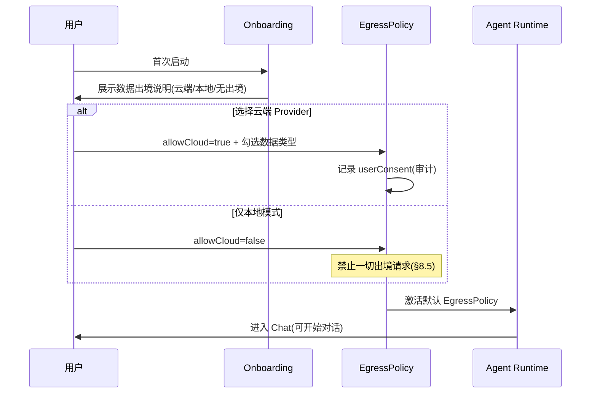

- 未授权云端时，云端 Provider 调用一律被 EgressPolicy 拦截（§8.5）。映射 Case 01。

### UF-02 语音输入闭环（ASR → 意图 → Tool → TTS，Phase 3/5）

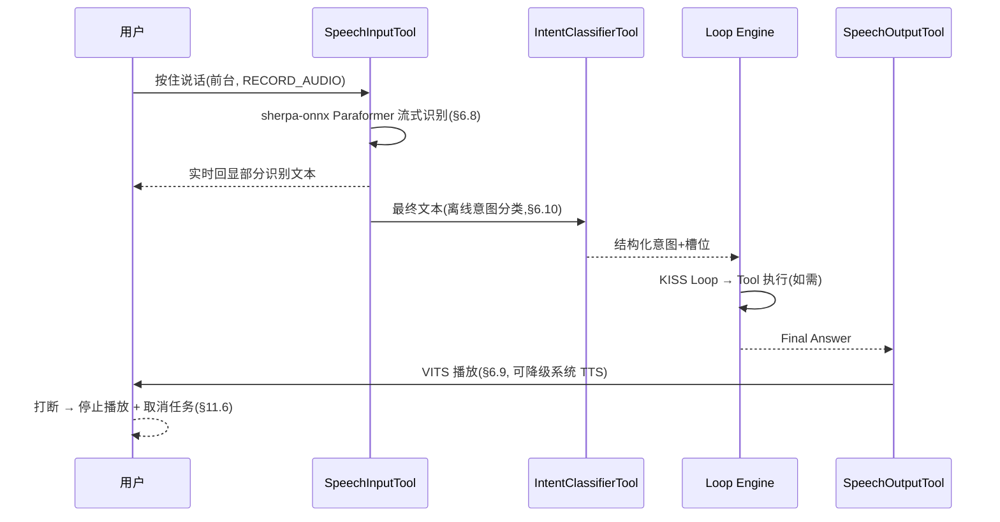

- 音频不落盘，录音即弃（§6.8 隐私）。映射 Case 02/03（语音变体）。

### UF-03 高风险 Tool 确认（Confirm Card）

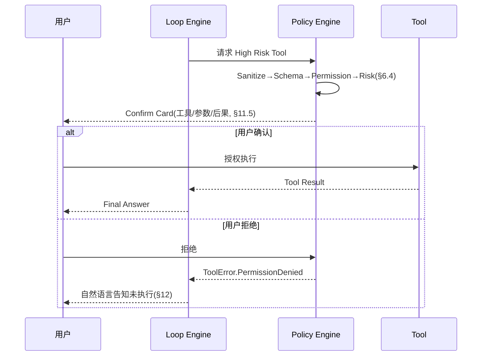

- 映射 Case 04 / Case 05。

### UF-04 权限拒绝与降级路径

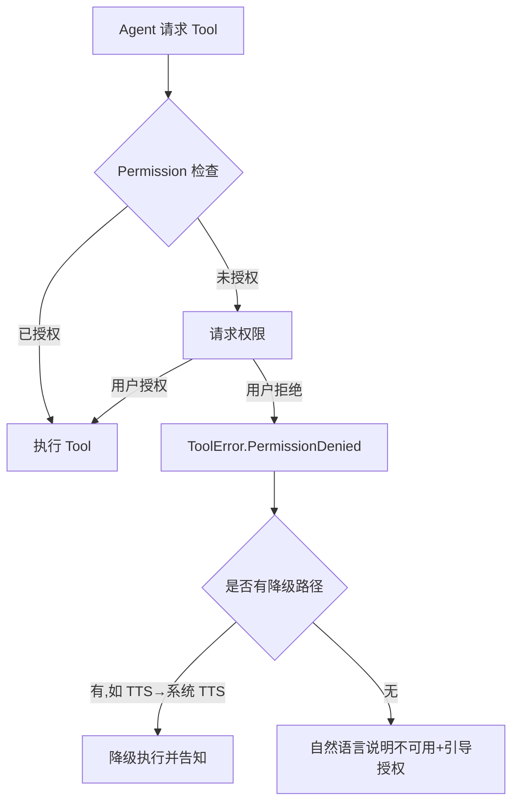

- 映射 Case 05。降级边界见规则 C（§6.9）、TTS 降级见 §6.9。

### UF-05 Process Death 任务恢复

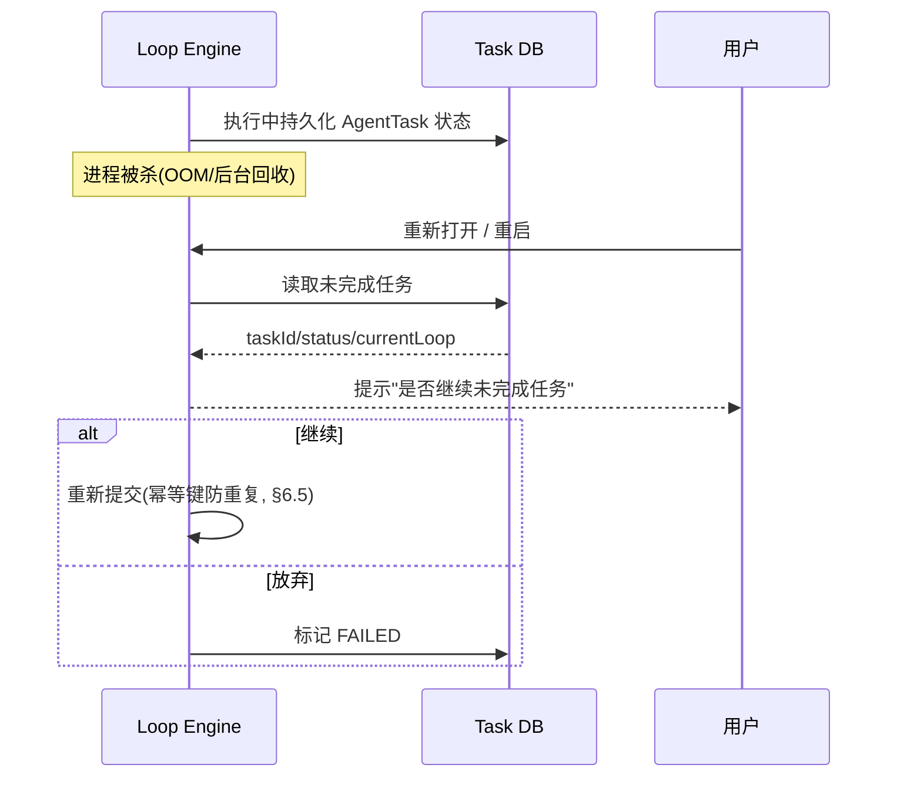

- 恢复 = Task 状态可恢复、Tool 副作用幂等；**不承诺 LLM 流续传**（§16.5）。映射 Case 08 / Case 09。

### UF-06 多步 Tool 链执行

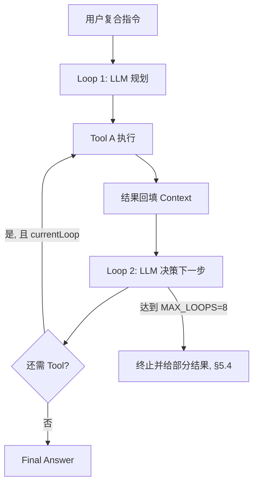

- 映射 Case 02/03/04 的复合场景。`MAX_LOOPS=8`（§5.4）。

### 流程 → E2E Case 映射

| 流程 | 覆盖路径 | 映射 Case |
|---|---|---|
| UF-01 | 出境授权 / 本地模式 | 01 |
| UF-02 | 语音 ASR→意图→TTS | 02 / 03 |
| UF-03 | 高风险确认 / 拒绝 | 04 / 05 |
| UF-04 | 权限拒绝 / 降级 | 05 |
| UF-05 | 进程死亡恢复 / 幂等 | 08 / 09 |
| UF-06 | 多步 Tool 链 | 02 / 03 / 04 |

---

# 5. 总体架构与 Agent Runtime

## 5.1 总体架构

```text
┌─────────────────────────────────────────────┐
│                  UI / Gateway               │
│ Chat / Quick Action / Notification / Tile  │
└──────────────────────┬──────────────────────┘
                       │
┌──────────────────────▼──────────────────────┐
│                 Agent Runtime               │
│ Task Manager                                 │
│ Loop Engine                                  │
│ Policy Engine                                │
│ Context Builder                              │
└───────────┬────────────┬────────────┬───────┘
            │            │            │
     ┌──────▼─────┐ ┌────▼─────┐ ┌───▼────────┐
     │ LLM Layer  │ │  Memory  │ │ Tool Layer │
     │ Provider   │ │ Manager  │ │ Registry   │
     └──────┬─────┘ └────┬─────┘ └───┬────────┘
            │            │            │
      Cloud/Local       Room       Android API
                       FTS5        Intent
                       Vector       Calendar
                                   Location
                                   Accessibility
```

## 5.2 Task 是一级执行单位

每次用户请求创建一个 `AgentTask`。

```text
AgentTask
 ├── taskId
 ├── conversationId
 ├── userInput
 ├── status
 ├── createdAt
 ├── updatedAt
 ├── currentLoop
 ├── maxLoops
 ├── timeoutAt
 ├── cancellationRequested
 └── lastError
```

## 5.3 状态机

```text
IDLE
 │
 ▼
PREPARING
 │
 ▼
THINKING
 │
 ├── FINAL ───────────────► COMPLETED
 │
 ▼
TOOL_PENDING
 │
 ▼
POLICY_CHECK
 │
 ├── DENIED ──────────────► WAITING_USER
 │
 ▼
TOOL_EXECUTING
 │
 ├── RETRY
 ├── FAILED ──────────────► FAILED
 │
 ▼
TOOL_RESULT
 │
 ▼
MEMORY_UPDATE
 │
 ▼
THINKING
```

## 5.4 Loop Engine 详细规则

主循环伪代码：

```kotlin
suspend fun run(task: AgentTask) {
    while (task.loopCount < task.maxLoops) {

        ensureNotCancelled(task)
        ensureNotTimeout(task)

        val context = contextBuilder.build(task)

        val response = llm.generate(context)

        when (response) {
            is FinalAnswer -> {
                complete(task, response)
                return
            }

            is ToolCall -> {
                policyEngine.check(response)

                val result = toolExecutor.execute(response)

                persistToolResult(result)

                if (result.isFatal) {
                    fail(task, result.error)
                    return
                }
            }
        }

        task.loopCount++
        persist(task)
    }

    fail(task, MaxLoopExceeded)
}
```

默认参数：

| 参数 | MVP |
|---|---:|
| MAX_LOOPS | 8 |
| Tool Timeout | 15s |
| LLM Timeout | 60s |
| Task Timeout | 120s |
| Retry | 2 |
| Context Token Budget | 8K |
| Tool Result 最大长度 | 8KB |

这些参数必须配置化，不允许散落在业务代码中。

## 5.5 运行约束：ANR 防护（评审修正 #1）

Agent Loop 不得运行在主线程协程上——Tool 超时（15s）+ LLM 超时（60s）调度不当极易触发 ANR。

- Loop Engine 必须运行在自定义 `CoroutineDispatcher`（如 `Dispatchers.Default` + 自定义线程池）。
- UI 层仅收集 `StateFlow`，不做任何阻塞或计算工作。

## 5.6 必须支持的事件

- Cancel
- Timeout
- Process Death Recovery（边界见 §16.5：Task 状态可恢复、Tool 副作用可幂等；不恢复 LLM 流）
- Network Loss
- Tool Failure
- User Permission Denied

---

# 6. Tool 架构与 Policy Engine

## 6.1 Tool Interface

```kotlin
interface AgentTool {
    val descriptor: ToolDescriptor

    suspend fun execute(
        arguments: JsonObject,
        context: ToolContext
    ): ToolResult
}
```

## 6.2 Tool Descriptor

```kotlin
data class ToolDescriptor(
    val name: String,
    val description: String,
    val inputSchema: JsonObject,
    val riskLevel: RiskLevel,
    val requiredPermissions: Set<Permission>,
    val requiresConfirmation: Boolean
)
```

## 6.3 Risk Level

| Level | 示例 | 用户确认 |
|---|---|---|
| L0 | 当前时间、电量 | 否 |
| L1 | 查询日历、读取剪贴板 | 默认否，可配置 |
| L2 | 创建日历事件、写剪贴板 | 是 |
| L3 | SMS、Call、Accessibility 操作 | 每次确认 |
| L4 | 支付、删除重要数据、账号操作 | MVP 禁止 |

## 6.4 Policy Engine 执行链

LLM 请求 Tool 后不能直接执行。执行链（含评审修正 #11 的 `ToolCallSanitizer`）：

```text
LLM Tool Call
      ↓
ToolCallSanitizer（参数类型强制转换 + 默认值填充）
      ↓
Schema Validate
      ↓
Permission Check
      ↓
Risk Check
      ↓
User Confirmation?
      ↓
Tool Execute
      ↓
Audit Log
      ↓
Result
```

- **ToolCallSanitizer（评审修正 #11）**：真实 LLM 的 Tool Calling 成功率约 95–98%，存在参数类型错误、必填字段缺失、编造不存在的 Tool 等幻觉。Sanitizer 在 Schema Validate 之前进行参数类型强制转换和默认值填充，而不是直接拒绝导致 Task 失败；对确实无法修复的调用才拒绝。
- 任何 Tool 都必须经过 Policy Engine，无例外路径。

## 6.5 Tool 幂等与恢复

对于创建型 Tool 必须提供：

```text
idempotencyKey = taskId + toolCallId
```

例如：

Agent 创建日历事件时，如果 App 在 Tool 执行后被杀死：

恢复任务不能再次创建相同事件。

Tool Adapter 必须能够：

- 查询已有执行记录
- 判断是否已经完成
- 返回历史 Result
- 避免重复副作用

**评审修正（建议 #3）**：幂等键（`taskId + toolCallId`）必须在 Phase 1 就实现，不要等到 Phase 4 再补；后期补幂等性等于重写 Tool 层。

## 6.6 剪贴板 Tool 约束（评审修正 #9）

Clipboard Read 在 Android 12+ 有 `READ_CLIPBOARD` 隐私指示器（Privacy Indicator），Google Play 可能要求解释后台读取剪贴板的原因。

- MVP 中剪贴板 Tool 仅在前台激活时可用，禁止后台读取剪贴板。

## 6.7 屏幕感知与操作 Tool（参考 FGA，决策 #15/#16）

参考开源实现 FGA（Fate-Grand-Automata，Kotlin 原生，MIT 协议），其能力链为"MediaProjection 截图 → OpenCV 模板匹配 → Accessibility 点击/滑动"。本方案按风险拆分引入：

| Tool | 能力 | Risk Level | 权限/约束 | 分期 |
|---|---|---|---|---|
| `ScreenCaptureTool` | MediaProjection 截图（数据源） | L1 | 前台服务 + 系统授权弹窗；Android 14+ 需 `foregroundServiceType=mediaProjection`；仅前台激活 | MVP（Phase 3） |
| `ScreenMatchTool` | OpenCV 模板匹配：识别界面状态/按钮位置，read-only 断言 | L0 | 无额外权限；输入为已授权截图与本地模板库 | MVP（Phase 3） |
| `TapSwipeTool` | Accessibility 点击/滑动（像真人操作） | L3 | 每次确认；独立高风险管理（§10.2）；Play 分发下不得用于第三方 App 自动化 | Beta / 侧载变体 |

设计约束：

1. **感知与控制分离**：MVP 仅引入感知（截图 + 匹配，read-only），不与 §3.2 非目标"自动控制所有第三方 App"冲突；控制（`TapSwipeTool`）进入 Beta。
2. **屏幕数据不出设备**：截图仅本地处理，不进 Prompt 全文；`ScreenMatchTool` 输出结构化 JSON（模板名 / 匹配位置 / 置信度），截图按 Sensitive 分类（§9.1），日志禁止记录截图内容；截图落盘仅限应用私有目录，必要时加密存储。
3. **不可信数据**：屏幕上的外部文本（游戏/网页/第三方 App 内容）属于 `UNTRUSTED_DATA`（§9.4 第 5 条），匹配结果不得视为可信指令。
4. **幂等**：`TapSwipeTool` 必须复用 §6.5 幂等机制（`idempotencyKey = taskId + toolCallId`），避免重复点击副作用。
5. **失败语义**：匹配置信度低于阈值时明确返回失败（`ToolError.ExecutionFailed`，§12），不得猜测；MediaProjection 授权被取消映射为 `ToolError.PermissionDenied`。
6. **依赖与体积**：OpenCV 引入的包体积增量在 Phase 3 验证（预计 10–20MB 量级），必要时裁剪模块；FGA 为 MIT 协议，实现可参考并标注来源。
7. **分发渠道（决策 #16/#17）**：双渠道已确认启用——**play 包**（Google Play 合规路径，无 Accessibility 功能，面向轻度用户）与 **sideload 包**（侧载发布，含 `TapSwipeTool`，用户手动赋予权限、onboarding 完全知情）。两包构建期通过 Gradle product flavors 产出（见 §17.4），完全隔离。

## 6.8 离线中文 ASR Tool（语音输入，决策 #19）

参考框架 **sherpa-onnx**（官方支持 Android 完全离线推理：不联网、全部本地处理，提供 Kotlin API 与 Android APK 示例）。

### 能力链路

```text
麦克风采集(16kHz)
   ↓
VAD 端点检测(silero_vad.onnx, ~2MB, 无语音不推理)
   ↓
ASR 推理(sherpa-onnx, ONNX int8, 本地 CPU)
   ↓
后处理(ITN / 标点 / 热词)
   ↓
SpeechInputTool → 转录文本 → AgentTask(Loop Engine)
```

- **Tool-driven（§2.3）**：Agent 不直接访问麦克风数据，只能通过 `SpeechInputTool` 获取转录文本。
- **完全离线**：推理全程本地；模型下载是**入站**流量（下载后离线使用），不构成数据出境（§8.5）。

### 模型选型（主选 + 备选）

| 模型 | 角色 | int8 大小 | 特点 |
|---|---|---|---|
| **Paraformer-zh**（阿里 FunASR） | **主选** | ~230MB（标准版更小，另有 `zh-small`） | 中文识别精度顶级；专注 ASR；RTF≈0.07（单线程） |
| **SenseVoiceSmall**（阿里 FunAudioLLM） | **备选** | 228MB | 多语言（中/粤/英/日/韩）+ 情感/事件检测；ITN 自带标点；RTF≈0.1 |

- **切换机制**：两个模型共用同一 `SpeechInputTool` 接口，通过模型路径配置切换；**验收触发**——Paraformer-zh 实机效果未达验收标准（中文普通话识别准确率目标）时，切换启用 SenseVoiceSmall。
- 模型必须使用 **int8 量化版**（fp32 高达 ~894MB，手机端不可行）。

### 双渠道模型部署策略（区分 2 个版本应用）

| 渠道 | 模型部署 | 说明 |
|---|---|---|
| **play 包** | **不内置模型**，保持 APK 轻量（轻度用户） | 语音功能首次启用时，经用户确认后按需下载 Paraformer-zh int8 至私有目录 `filesDir`；提供下载进度与存储/流量提示；下载走 HTTPS + 哈希校验；完成后完全离线可用 |
| **sideload 包** | **内置 Paraformer-zh int8**（重度用户一次到位） | 模型随 APK 或首次启动静默就位；可选按需下载备选 SenseVoiceSmall |

- 与 §17.4 构建期隔离一致：play flavor 资源不含模型文件；sideload sourceSet 内置模型。

### 权限与隐私

- **权限**：`RECORD_AUDIO`（运行时申请，走 §10.1 流程）；Android 14+ 录音需前台服务类型 `FOREGROUND_SERVICE_MICROPHONE`；语音输入仅前台激活时可用。
- **隐私（对齐 §9.1）**：音频数据按 Sensitive 分类——仅本地处理、不写入 Prompt 全文（仅转录文本进入上下文）、不入日志；模型与音频均存应用私有目录。

### 验收标准与备选切换（规则 D）

- **验收阈值**：自建中文普通话测试集（≥ 500 条，覆盖日常指令/数字/专名/中英混读）上 **CER ≤ 5%**，且端到端语音输入（含 VAD）成功率 ≥ 95%；同时满足才算达标。
- **切换判定**：Paraformer-zh 未达标（CER > 5% 或端到端成功率 < 95%）时，按决策 #19 切换启用 SenseVoiceSmall 并按同一阈值复测；两模型均未达标时降级为"文本输入为主、语音输入标记实验性"，不得静默宣称离线语音可用。
- **性能底线**：目标机型单线程 RTF ≤ 0.5（int8），否则启用多线程或评估 `paraformer-zh-small`。

## 6.9 离线 TTS Tool（语音输出，决策 #20）

与 ASR（§6.8）同框架（sherpa-onnx）实现语音输出，构成**离线语音闭环**：

```text
AgentTask Final Answer(文本)
   ↓
SpeechOutputTool(TTS 推理, 本地)
   ↓
音频播放(MediaPlayer/AudioTrack)
```

### 方案对比（包体大小 / 性能 / 语音多样性）

| 方案 | 包体增量 | 性能 | 语音多样性 | 结论 |
|---|---|---|---|---|
| **sherpa-onnx VITS 系**（`vits-zh-hf-fanchen-C` 等） | ~116MB（fp32） | RTF 低，移动 CPU 可实时 | **高且可控**：5 / 174 / 187 / 804 音色，`sid` 指定 | **主选** |
| **sherpa-onnx Kokoro**（中英） | ~310MB + 26MB（有 int8 版） | RTF 高（2.7–6.6，RPi4 参考），移动端实时性存疑 | 53–103 音色，音色自然度好 | 备选（音色自然度优先时评估） |
| **Android 原生 TextToSpeech** | **0MB** | 系统引擎负责，快但不可控 | 低：中文 1–2 音色，**跨设备不可控**（Google/OEM 引擎差异） | **仅降级回退** |

### 模型选型与部署（决策 #20）

- **主选**：`vits-zh-hf-fanchen-C`（中文 187 音色，~116MB）——包体与音色多样性的最佳平衡；**备选**：`vits-zh-hf-theresa/eula`（804 音色）、`vits-zh-ll`（5 音色，小包体）、`Kokoro`（自然度优先，需评估移动端 RTF）。
- **部署策略与 ASR 一致**：play 包不内置 TTS 模型（按需下载）；sideload 包内置（离线闭环一次到位）。
- **降级回退**：play 包 TTS 模型未就绪时，临时使用系统原生 TextToSpeech 播报（仅短提示音级），模型就绪后自动切换；**不使用系统 TTS 在线引擎**（数据出境风险，§8.5）。
- **权限**：TTS 推理无需额外权限；音频播放走标准 `AudioTrack`/`MediaPlayer`。

## 6.10 本地意图理解 Tool（IntentClassifierTool，决策 #21）

### 定位

为 Agent 提供**离线中文意图理解**：意图分类、槽位初提取与任务路由。它不是主 LLM 的替代——复杂推理仍由 Cloud LLM（或未来端侧大模型）承担；本地分类器负责**快速、离线、隐私**的意图路由。

```text
用户输入(文本 / ASR 转录)
   ↓
IntentClassifierTool(中文编码器 ONNX, 复用 ONNX Runtime)
   ↓ 输出结构化意图(类别 / 槽位 / 路由建议 / 置信度)
AgentTask 路由 → 匹配 Tool / 决定是否调用 Cloud LLM
```

### 模型选型（决策 #21，V2.1.11）

- **主选**：**中文小编码器 + 微调分类头**（MiniRBT 量级骨干，约 10–20MB；在覆盖 10+ 常见意图的自建集上微调至规则 E）。一次前向、softmax 得 `intent` 与 `confidence`；`route` 由标签表映射，不采样、不生成 token。
- **运行时**：ONNX；与 ASR/TTS **共用**已有 `libonnxruntime.so`（CPU / XNNPACK / NNAPI）。禁止再链一份 ORT 或为意图单独引入 llama.cpp / LiteRT-LM / ExecuTorch / MLC。
- **槽位**：MVP 用规则抽取（应用名、时间短语等）；编码器不负责自由 JSON。复杂槽位在置信度低于阈值时向用户澄清或回退 Cloud LLM（与规则 E 一致）。
- **包布局**（catalog / 外部目录 / `filesDir` 缓存同名）：`models/intent/` 下为分类包（至少 `model.onnx` + tokenizer + `labels.txt`；具体文件名由官方 catalog 哈希锁定）。**不再**使用 `model.gguf`，**不再**提供意图 Q4/Q8 互斥量化行。
- **排除**：SmolLM2-135M / 360M（官方 Limitations 声明以英文为主）。
- **历史方案（不作实现依据）**：Qwen3-0.6B-Instruct GGUF + llama.cpp JNI（含 Vulkan/CPU 回退与 thinking 预填）；Qwen2.5-0.5B GGUF。端侧生成式小 LLM（含 LiteRT-LM Qwen3-0.6B、高通 GenieX）可用于日后「完整端侧 LLM」探索，**不是**本 Tool 的验收路径。
- **输出契约**：Tool Result 仍为结构化 JSON（意图类别 / 槽位 / 路由建议 / 置信度），与 §6.2 一致；由引擎把分类结果填进该契约，而不是让模型自由生成 JSON。

### 预算与部署（独立于语音预算）

- **包体隔离**：意图分类包是独立**可选下载模块**（约 10–20MB），**不计入语音闭环预算**（规则 A 的 ≤400MB 不变）；sideload 包可内置或按需下载，play 包一律按需下载。
- **部署**：模型文件走 HTTPS + 哈希校验（同 §6.8）；仅本地推理，输入文本与意图结果不出设备（对齐 §9.1 Sensitive 分类）。
- **定标（规则 E）**：中文意图分类准确率 ≥ 90%（自建意图测试集，覆盖 10+ 常见意图类别）；目标机型单次意图推理 P95 ≤ 500ms；置信度低于阈值时回退到 Cloud LLM 或向用户澄清，不得静默猜测。

### 遗留待定处理规则（Phase 5 定标）

以下待定项已规则化，不再悬置，Phase 5 按规则定标：

- **规则 A — 包体预算与量化**：sideload 包语音模型总内置预算 **≤ 400MB**（ASR Paraformer-zh ≤ 230MB + TTS VITS 系 ≤ 120MB + VAD ~2MB ≈ 352MB，达标）。优先使用官方量化版本（int8 若有）；VITS 默认 fp32（116MB）在预算内；超预算时优先裁减备选模型或降为 `vits-zh-ll`（115MB）。备选模型（SenseVoice、Kokoro）一律按需下载，不计入内置预算。
- **规则 B — Kokoro 启用门槛**：Kokoro 仅当目标机型**实机单线程 RTF ≤ 1.0** 且音色自然度评审通过时启用；默认不内置（按需下载）；不达标则维持 VITS 系。
- **规则 C — 系统 TTS 降级边界**：降级仅限 play 包 TTS 模型未就绪/加载失败时，且**仅用于短提示类播报**；Agent 正式回复**不得静默降级**（应提示"语音回复暂不可用"）；sideload 包不启用系统 TTS 降级（模型内置，必须本地合成）。

---

# 7. Memory 架构与治理

## 7.1 Conversation Memory

核心表：

```text
conversations
messages
tool_calls
tool_results
agent_tasks
```

## 7.2 Semantic Memory

核心结构：

```text
memory_id
type
content
embedding
source_message_id
confidence
created_at
updated_at
expires_at
```

**MVP 实现策略（评审修正 #5、建议 #2）：**

- MVP 阶段 Semantic Memory 不需要完整的 embedding + vector search：先用 **FTS5 全文检索 + 关键词匹配** 实现"找到历史事实"。
- `embedding` 字段保留于数据模型（`nullable`），Beta 阶段再引入向量语义检索。
- 若 Beta 阶段实现向量检索，优先考虑 ONNX Runtime 本地跑 embedding 模型 + 暴力余弦相似度（事实量 < 1K 时性能可接受），避免引入额外 Vector DB 依赖；事实数量 > 5K 时再考虑索引优化。
- 不引入 sqlite-vec（Android 需 NDK 编译、性能未经验证）与 ObjectBox（增加包体积与学习成本）作为 MVP 依赖。

## 7.3 Memory 必须可追溯

任何长期事实都必须记录：

```text
Fact
 ├── content
 ├── source
 ├── confidence
 ├── createdAt
 └── updatedAt
```

不能出现：

> Agent 自己记住了某件事情，但用户不知道它从哪里来的。

## 7.4 Memory Gate

Memory Gate 不应简单地"每轮都让 LLM 判断"。

```text
Conversation Finished
       ↓
Cheap Filter
       ↓
Candidate Fact Extraction
       ↓
Deduplication
       ↓
Confidence Check
       ↓
Persist
       ↓
Embedding（Beta 阶段启用）
```

## 7.5 不应该记忆

- 一次性临时信息
- 密码
- Token
- API Key
- 身份认证信息
- 银行卡信息
- 用户明确要求"不记住"的内容

## 7.6 用户控制

Memory UI 必须支持：

- 查看
- 编辑
- 删除
- 全部清空
- 禁用 Memory
- 查看来源

---

# 8. Context Builder 与 LLM Adapter

## 8.1 Context 组装优先级

Context 不允许无限拼接。

```text
System / SOUL
   ↓
Current User Input
   ↓
Relevant Memory
   ↓
Recent Conversation
   ↓
Tool Result
```

## 8.2 Context Builder 必须执行

- Token Budget
- Sliding Window
- Memory Ranking
- Tool Result Truncation
- Sensitive Data Filtering

## 8.3 Token 计数与 Budget（评审修正 #6）

- Context Token Budget（8K）在移动端是合理的，但不同 Provider 分词器不同，Android 端需要本地实现 Token 计数（用于 Context Budget）。
- 采用统一的最坏情况估算：**1 token ≈ 0.75 个汉字 / 0.25 个英文单词**（或 `tiktoken` 的 Kotlin 移植版/近似算法）。
- 接近 Budget 时**优先截断 Tool Result，而非 Memory**。

## 8.4 LlmProvider 接口

统一接口：

```kotlin
interface LlmProvider {

    suspend fun generate(
        request: LlmRequest
    ): Flow<LlmEvent>
}
```

Provider 不应被 Loop Engine 直接绑定。

```text
Agent Runtime
      │
      ▼
LlmProvider
 ├── OpenAICompatible
 ├── LocalLlama
 └── FutureProvider
```

## 8.5 数据出境策略

每次请求必须生成：

```text
EgressPolicy
 ├── allowCloud
 ├── allowedDataTypes
 ├── excludedMemory
 ├── excludedTools
 └── userConsent
```

默认：

```text
allowCloud = false
```

如果用户主动配置 Cloud Provider，则明确提示：

> 本次请求可能将输入、必要上下文和 Tool Result 发送至第三方 LLM 服务。

---

# 9. 安全与隐私

## 9.1 数据分类

| 分类 | 示例 | 默认策略 |
|---|---|---|
| Public | 普通用户输入 | 可配置 |
| Personal | 日程、位置 | 本地 |
| Sensitive | 通讯录、聊天 | 本地 |
| Secret | Token、Password | 禁止进入 Prompt |

## 9.2 API Key

使用 Android Keystore。

禁止：

- SharedPreferences 明文
- SQLite 明文
- Logcat 输出
- Crash Log 输出

## 9.3 日志脱敏

日志禁止记录：

- Prompt 全文
- Token
- API Key
- GPS 精确坐标
- SMS 内容
- 联系人内容

**评审修正 #10**：Release 构建必须关闭所有 LLM 原始响应的日志输出。

## 9.4 Prompt Injection 防护

由于 Agent 能调用真实 Android Tool，Prompt Injection 是核心风险。

必须：

1. Tool Result 不得被默认视为可信指令。
2. 外部文本不得修改 System Policy。
3. Tool 参数必须 Schema Validate。
4. 高风险操作必须重新进行 Policy Check。
5. 来自网页、通知、第三方 App 的内容标记为 `UNTRUSTED_DATA`。

## 9.5 Google Play 政策（评审修正 #8）

- AccessibilityService 审核极其严格：未来进入 Beta 时需提交"为什么需要此权限"的视频演示，且不能用于自动化点击第三方 App（可能违反开发者政策）。团队需提前知悉。
- 前台 Service 需声明 `foregroundServiceType`，Android 14+ 限制更严。

**双渠道合规红线（决策 #17）**：

- **play 包内零侧载引用**：play 包不得包含任何指向 sideload 包的引导痕迹（文案、deep link、隐藏入口、代码字符串），用户已拍板两渠道完全隔离；play 包按"无 Accessibility 功能的合规产品"形态宣传与运营。
- play 包不含 `TapSwipeTool` 与 AccessibilityService 声明（CI 防泄漏校验，见 §17.4）。
- **play 包感知能力同样需政策合规**：play 包的 `MediaProjection` 截图能力（§6.7）需在隐私政策中明确声明用途（仅本地屏幕状态感知、数据不出设备），并按 Play 政策要求提供用途说明，避免审核盲区。
- **play 包语音能力隐私声明**：若 play 包启用语音输入（ASR，Beta），`RECORD_AUDIO` 录音用途（仅本地转写、音频不出设备、不入 Prompt/日志）需同步写入隐私政策声明，避免审核盲区。
- 具体 Play 政策条文以 Google Play 开发者政策最新版本为准，上架前由团队对照最新政策核实。

---

# 10. Android 权限与后台执行

## 10.1 权限申请流程

权限不是"安装时一次申请"。

```text
Feature Intent
    ↓
Need Permission?
    ↓
Explain Why
    ↓
Android Permission
    ↓
Grant / Deny
    ↓
Persist Decision
```

## 10.2 Accessibility 管理

Accessibility 必须独立作为高风险能力管理，MVP 不包含（Beta 能力，见 §9.5 的 Play 审核要求）。

屏幕点击/滑动自动化（`TapSwipeTool`，FGA 式，见 §6.7）属 Accessibility 操作：Google Play 分发下不得用于自动化点击第三方 App；仅作为 **Beta 侧载变体** 提供，与 Play 版本隔离（决策 #16/#17）。

**sideload 包 onboarding 显式知情同意（决策 #17）**：

- 首次启动必须完成**显式知情同意流程**（非默认勾选话术）：逐项说明权限用途（Accessibility 用于屏幕点击/滑动）、能力边界（不得用于银行/支付/密码管理器，见 §3.2）、风险告知与免责声明，用户逐项确认后方可启用 `TapSwipeTool`。
- 侧载包承担独立的隐私与安全审计责任（不经 Play 审核，责任归发行方）；记录用户同意时间戳与版本（Audit Log）。
- **同意撤回与重确认**：用户可随时在系统设置或 App 内撤销 Accessibility 权限，撤销后 `TapSwipeTool` 立即失效（感知能力不受影响）；`TapSwipeTool` 能力发生重大变更（如新增高风险操作类别）时，升级后需重新走知情同意流程。
- **Play Protect / OEM 安全软件误报应对**：侧载包需准备风险说明文档（官网 FAQ）与签名校验指引；因 Accessibility 特性触发系统安全提示属预期行为，不得绕过系统提示。

## 10.3 后台执行

原 PRD 中"WorkManager + 断点续传"需要进一步修正。

WorkManager 适合：

- 延迟任务
- 周期任务
- 数据同步
- Memory Embedding
- 可恢复后台工作

不应假设：

> WorkManager 可以保证 Agent 长时间持续运行。

实时 Agent Loop 由前台 App / 前台服务场景负责；后台任务必须接受 Android 系统调度限制。前台 Service 需正确声明 `foregroundServiceType`。

Process Death Recovery 的实现依赖 Room 中的 Task 状态 + `SavedStateHandle`；LLM 的流式响应无法恢复（必须重试），见 §16.5。

## 10.4 OEM 兼容性预算（评审修正 #13）

Android 13–16 在三星、小米、华为等厂商的后台策略差异巨大，预留 **20% 的工期**用于处理厂商特定的权限行为和后台限制（已计入 §15 总工期口径）。

---

# 11. UI

## 11.1 Chat

必须显示：

```text
User
  ↓
Thinking...
  ↓
Calling Calendar
  ↓
Waiting for permission
  ↓
Tool Result
  ↓
Final Answer
```

用户不能只看到：

> Agent 正在思考……

而不知道发生了什么。

## 11.2 Permission Center

显示：

- 已授权
- 未授权
- 高风险
- 最近使用
- 一键撤销

## 11.3 Task History

每个任务显示：

- 输入
- 状态
- Loop 次数
- Tool
- 耗时
- Provider
- 错误

## 11.4 设计令牌（Design Tokens，Material Design 3）

基于 Jetpack Compose + Material Design 3（§17.1）。令牌命名对齐 M3，明暗双主题。

| 类别 | 令牌 | 值（亮色 / 暗色） | 用途 |
|---|---|---|---|
| 主色 | `md.sys.color.primary` | `#006A6A` / `#4CDADA` | 主操作、确认按钮 |
| 危险色 | `md.sys.color.error` | `#BA1A1A` / `#FFB4AB` | 高风险 Tool、删除、拒绝 |
| 表面 | `md.sys.color.surface` | `#FAFDFC` / `#191C1C` | 背景 |
| 表面容器 | `md.sys.color.surface-container` | `#EBF0EF` / `#1D2121` | 卡片、Chat Bubble 容器 |
| 正文 | `md.sys.type.body-large` | 16sp / 24sp 行高 | 对话正文 |
| 标注 | `md.sys.type.label-medium` | 12sp | 状态、时间戳、来源 |
| 标题 | `md.sys.type.title-medium` | 16sp/500 | 卡片标题 |
| 间距 | `spacing.xs/sm/md/lg/xl` | 4 / 8 / 16 / 24 / 32dp | 统一间距栅格 |
| 圆角 | `shape.corner.medium` | 12dp | Bubble / Card |
| 圆角 | `shape.corner.small` | 8dp | Chip / 小按钮 |

- 栅格：8dp 基准网格，组件内边距 `md(16dp)`，卡片间距 `sm(8dp)`，区块间距 `lg(24dp)`。
- 无障碍：正文对比度 ≥ 4.5:1，危险操作同时依赖文字而非仅颜色。

## 11.5 核心组件规范

### Chat Bubble（5 种状态）

| 状态 | 容器 | 内容 | 验收点 |
|---|---|---|---|
| User | primary 容器，右对齐 | 用户文本 / 语音转写 | 语音消息显示来源标注 |
| Thinking | surface-container，左对齐 | 状态文字(Thinking/Calling X) | 对应 §11.1 流转图，非"正在思考…" |
| Tool | surface-container + 图标 | Tool 名 + 参数摘要 + 结果 | 可展开查看结构化 Tool Result |
| Confirm | **Confirm Card**（见下） | 高风险 Tool 待确认 | 必须用户显式确认/拒绝 |
| Final | surface-container，左对齐 | Final Answer + 来源引用 | 引用 Memory 时显示来源(US-001) |

### Confirm Card（高风险 Tool 确认，对应 UF-03）

- 结构：Tool 图标 + 名称 + **风险等级徽标**（High=error 色）+ 参数明细 + 后果说明 + [确认 / 拒绝] 双按钮。
- 规则：拒绝按钮与确认按钮同级（不得弱化）；参数为敏感数据（日历/短信）时高亮；超时未操作视为拒绝（不执行）。
- 验收点：对应 Case 04（确认执行）/ Case 05（拒绝不执行）。

### Permission 条目（Permission Center）

- 字段：权限名 + 授权状态（已授权/未授权/高风险徽标）+ 最近使用时间 + 一键撤销按钮（§11.2）。
- 高风险权限（Accessibility / MediaProjection）常驻徽标 + 撤销后即时生效（决策 #17 同意撤回，§10.2）。

### Task History 条目

- 字段：输入摘要 + 状态徽标（COMPLETED/FAILED）+ Loop 次数 + Tool 链 + 耗时 + Provider + 错误码（§11.3）。

## 11.6 关键交互状态

- **Thinking 流转**：必须展示 §11.1 完整状态链（User→Thinking→Calling→Tool Result→Final），禁止只显示"正在思考"。状态切换伴随进度指示（§11.7）。
- **权限申请弹窗**：说明用途 + 数据去向（Egress）；拒绝后 Tool 不执行并自然语言告知（UF-04）。
- **错误提示**：用户可见为自然语言（§12），如"网络超时，请重试"；开发者细节进 Task History。
- **空态**：无对话时显示引导（示例指令）；无权限时 Permission Center 显示引导授权。
- **打断**：TTS 播放中可点击停止并取消任务（UF-02）。
- **加载态**：模型下载（ASR/TTS/意图，play 包按需）显示进度 + 可取消。

## 11.7 动效规范

| 场景 | 时长 / 曲线 | 说明 |
|---|---|---|
| Bubble 进入 | 200ms `FastOutSlowIn` | 淡入 + 上移 8dp |
| 状态切换 | 150ms `LinearOutSlowIn` | Thinking→Calling 等 |
| Confirm Card 弹出 | 250ms `FastOutSlowIn` | 底部上滑 + 背景压暗 |
| Tool 执行进度 | 不确定进度条 | High Risk 显示步骤名 |
| 页面转场 | 300ms 共享元素 | Chat ↔ Task History |

- 不打断原则：动效期间可交互；减少动画（系统"移除动画"）时降级为淡入。

## 11.8 三屏布局细化

### Chat 屏（§11.1）

```text
┌──────────────────────────┐
│ AppBar: 标题 + Provider 状态 │
├──────────────────────────┤
│                          │
│   Bubble 列表(5 种状态)    │
│   Confirm Card(可覆盖)     │
│                          │
├──────────────────────────┤
│ 输入栏: [语音钮][文本][发送] │
└──────────────────────────┘
```

- 输入栏 `md` 内边距；语音钮长按录音（前台，§6.8）；Provider 状态徽标指示云端/本地（Egress）。

### Permission Center 屏（§11.2）

- 分组列表：按权限组（日历/通讯录/位置/麦克风/Accessibility）分 Section，Section 标题 `title-medium`。
- 每项为 Permission 条目（§11.5），高风险组置顶并 error 色徽标。

### Task History 屏（§11.3）

- 列表按时间倒序；每项可展开查看完整 Loop 链与 Tool Result；失败项 error 色状态徽标 + 错误码。

---

# 12. 错误模型

统一错误：

```text
AgentError
 ├── LlmError
 │   ├── Timeout
 │   ├── RateLimit
 │   ├── InvalidResponse
 │   └── Network
 ├── ToolError
 │   ├── PermissionDenied
 │   ├── Timeout
 │   ├── InvalidArgument
 │   └── ExecutionFailed
 ├── MemoryError
 ├── PolicyError
 └── RuntimeError
```

用户可见错误必须是自然语言。

开发者日志保留结构化错误码。

---

# 13. 可观测性

每个 Task 记录：

```text
task_id
total_latency
llm_latency
tool_latency
loop_count
token_input
token_output
tool_count
memory_hit
provider
error_code
```

核心指标：

| 指标 | MVP 目标 |
|---|---:|
| 简单问答 P95 | < 3s（不含云端异常） |
| Tool 调用成功率 | > 95% |
| Task 恢复成功率 | > 99% |
| Crash-free session | > 99.5% |
| 重复副作用 | 0 |
| 未授权 Tool 执行 | 0 |

---

# 14. 测试策略

## 14.1 分层覆盖

### Unit Test

覆盖：

- Loop State Machine
- Context Builder
- Policy Engine
- Tool Schema
- Memory Gate
- Retry
- Timeout
- Cancellation

### Integration Test

覆盖：

- LLM → Tool → Result → LLM
- Room Persistence
- Process Death Recovery
- Network Loss
- Permission Denied

### Instrumentation Test

覆盖：

- Calendar
- Location
- Intent
- Clipboard

### Security Test

覆盖：

- API Key 泄露
- Log 泄露
- 越权 Tool
- Prompt Injection
- 恶意 Tool 参数
- Accessibility 越权

## 14.2 MVP 测试优先级（评审修正 #12）

| 测试类型 | MVP 优先级 | 说明 |
|---|---|---|
| Loop State Machine Unit Test | P0 | 必须在 Phase 0 完成 |
| Tool Schema + Policy Unit Test | P0 | 必须在 Phase 3 完成 |
| Process Death Integration Test | P1 | 可用 `adb shell am kill` 自动化 |
| LLM→Tool→LLM Integration Test | P1 | 建议用 Fake LLM 做契约测试，而非依赖真实 API |
| Security Test | P2 | MVP 可用手动检查清单替代自动化 |
| Accessibility Instrumentation | Beta | MVP 不涉及 |

---

# 15. 分阶段 Roadmap（评审修正后工期）

总周期：**8–12 周**（2–3 人 Android 团队，含 20% OEM 兼容性预算）。可靠性（Phase 4 内容）作为**贯穿全程的质量基线**，每个 Phase 都包含对应的可靠性验收，而不是最后一周收尾。

## Phase 0：架构验证

周期：3–5 天（与评审一致）

交付：

- Kotlin Skeleton
- AgentTask
- Loop Engine
- Fake LLM
- Fake Tool
- State Machine Test
- `:cli` Agent Console 雏形（可选加分项，非阻塞）：mosaic 终端可视化状态机流转

完成标准：

> 可以通过 Fake Provider 完整执行 3 次 Tool Loop。

**生死线原则（评审建议 #1）**：如果 5 天内 Fake LLM + Fake Tool + State Machine 无法稳定跑通 3 次 Loop，说明状态机设计有缺陷，必须暂停后续开发，先修状态机；不要带着不稳定的核心进入 Phase 1。

## Phase 1：Cloud MVP

周期：3–4 周（原估算 1–2 周，评审修正 #3：真实 LLM 的 Tool Calling 不可靠需要大量防御性编码；Streaming + StateFlow 并发状态管理易出 bug）

拆分为两个子阶段：

- **Phase 1a**：Non-streaming + 1 个 Tool（Battery 或 Calendar），先跑通最小闭环。
- **Phase 1b**：引入 Streaming + 多 Tool、Tool Calling 防御性处理。

交付：

- Real LLM Provider
- Streaming
- Tool Calling
- Room
- Chat UI
- Task History
- Retry / Timeout / Cancel
- **创建型 Tool 的幂等键（`taskId + toolCallId`）**（评审建议 #3：从第一天开始，不等到 Phase 4）
- `:cli` Agent Console 日常调试化（可选，非阻塞）：Task 状态 / Tool 调用链 / Policy 检查可视化

完成标准：

> 用户可以完成真实对话，并可靠调用至少 2 个 Tool；创建型 Tool 具备幂等键。

## Phase 2：Local Memory

周期：2–3 周（原估算 1–2 周）

交付：

- FTS5
- Memory Gate
- Semantic Memory Interface（MVP 实现为 FTS5 + 关键词匹配，见 §7.2）
- Memory UI
- Memory Delete
- Source Tracking

完成标准：

> 用户能够让 Agent 从历史对话中找回至少一个相关事实。

## Phase 3：Android Tools

周期：2 周（原估算 1–2 周；Android 10–16 权限行为差异大，需兼容性测试）

交付：

- Battery
- Calendar
- Location
- Intent
- Clipboard（仅前台可用，§6.6）
- Screen Capture（MediaProjection，§6.7）
- Screen Match（OpenCV 模板匹配，§6.7）
- Permission Center
- Policy Engine

完成标准：

> 所有 Tool 均经过权限、Policy、Schema 验证。

## Phase 4：Reliability

周期：2–3 周（原估算 1 周，评审修正 #4：Process Death Recovery + Idempotency + Audit Log 是系统工程）

交付：

- Process Death Recovery
- Idempotency（创建型 Tool 已前置，本阶段收口全部副作用路径）
- Crash Recovery
- Network Retry
- Error UI
- Audit Log

完成标准（含评审修正 #7）：

> 在 Tool 执行前后杀进程，不产生重复副作用；Task 可重新提交或返回明确错误状态（不承诺 LLM 流断点续传）。

## Phase 5：Advanced（Beta）

- Accessibility（含 FGA 式屏幕点击/滑动自动化 `TapSwipeTool`，侧载变体，§6.7/§10.2）
- 离线中文 ASR（语音输入，sherpa-onnx，Paraformer-zh 主选 / SenseVoiceSmall 备选，§6.8）
- 离线 TTS（语音输出，sherpa-onnx VITS 系为主 / 系统 TTS 降级，§6.9）
- 本地意图理解（`IntentClassifierTool`，ONNX 中文编码器，离线意图路由，§6.10）
- Local LLM
- Notification
- Quick Settings
- Floating Widget
- Scheduled Agent
- Multi-modal Context
- 向量语义检索（Semantic Memory 升级）

## 长期规划：桌面端（决策 #18）

> 桌面端列入长期规划方向，但**开发优先级后置**：先完成 Android 端（play + sideload 双渠道）发布并稳定，`:cli` 发布并稳定后，再启动桌面端开发。MVP / Beta 阶段均不包含桌面端，不占用 8–12 周 MVP 工期。

**复用路径（届时评估确认）**：

- **直接复用**：`:core:*` 的 Agent Runtime（Loop / Policy / Memory / LLM / Tool 契约）——前提是守住 JVM 纯净红线（§17.2）；`:cli` 终端控制台可原样复用。
- **届时新增**：桌面 UI 层（如 Compose Multiplatform）、桌面 Tool 适配（文件系统 / 窗口 / 剪贴板等替代 Android API）、数据库跨平台迁移（如 SQLDelight）。
- **验收门槛**：Android 双渠道稳定发布 + `:cli` 稳定运行后，由产品评估启动桌面端的优先级与资源投入。

---

# 16. 验收计划

## 16.1 E2E 验收场景（14 个 Case，MVP 必须全部通过）

### Case 01
普通聊天 → Final Answer。

### Case 02
询问电量 → Battery Tool → Answer。

### Case 03
查询日历 → Calendar Tool → Answer。

### Case 04
创建日历 → Confirmation → Calendar Tool。

### Case 05
拒绝权限 → Tool 不执行。

### Case 06
LLM Timeout → Retry → Error。

### Case 07
Tool Timeout → Retry → Error。

### Case 08
Process Death → Task Recovery（恢复 = Task 状态可恢复、可重新提交，不要求 LLM 流续传，见 §16.5）。

### Case 09
重复恢复 → 不重复创建事件（幂等）。

### Case 10
Memory Retrieval → 找到历史事实并展示来源。

### Case 11
屏幕状态感知 → Screen Capture（MediaProjection 授权）→ Screen Match（模板匹配返回结构化结果）→ Agent 基于结果回答当前界面状态；拒绝截图授权时返回明确错误（§6.7）。

### Case 12
双渠道包隔离 → 构建 play 与 sideload 两包：play 包反编译确认无 AccessibilityService 声明与 `TapSwipeTool`；sideload 包含完整能力且两包同机共存互不覆盖（§17.4 验收红线）。

### Case 13
Onboarding 数据出境授权（UF-01）→ 未授权云端时，云端 Provider 调用被 EgressPolicy 拦截并提示；授权后正常对话。

### Case 14
Process Death 任务恢复（UF-05）→ 执行中杀进程后重开，提示继续未完成任务；继续时按幂等键不重复副作用（§16.5 边界）。

## 16.2 分阶段完成标准汇总

| Phase | 完成标准 |
|---|---|
| Phase 0 | 可以通过 Fake Provider 完整执行 3 次 Tool Loop |
| Phase 1 | 用户可以完成真实对话，并可靠调用至少 2 个 Tool；创建型 Tool 具备幂等键 |
| Phase 2 | 用户能够让 Agent 从历史对话中找回至少一个相关事实 |
| Phase 3 | 所有 Tool 均经过权限、Policy、Schema 验证 |
| Phase 4 | 在 Tool 执行前后杀进程，不产生重复副作用；Task 可重新提交或返回明确错误状态 |
| Phase 5（Beta，非 MVP 阻塞） | ASR 达标（CER ≤ 5% + 端到端成功率 ≥ 95%，规则 D）；TTS 按规则 A/B/C 定标（包体预算 ≤ 400MB、Kokoro 门槛、降级边界）；`TapSwipeTool` 侧载包 onboarding 与 L3 确认链完整（§6.7–§6.9、§10.2） |

## 16.3 Definition of Done

一个 Feature 只有同时满足以下条件才能进入 Release：

- [ ] Unit Test
- [ ] Integration Test
- [ ] Error Handling
- [ ] Permission Handling
- [ ] Cancellation
- [ ] Timeout
- [ ] Logging
- [ ] Privacy Review
- [ ] UI Empty State
- [ ] UI Error State
- [ ] Process Death Review
- [ ] UI 组件状态测试（覆盖 Chat Bubble 5 状态 + Confirm Card，§11.5）
- [ ] 核心接口契约含 KDoc + 异常 + 线程约束（LlmProvider/Tool/PolicyEngine/MemoryStore/ContextBuilder，§20.1）
- [ ] 文档更新

## 16.4 MVP 最小闭环

不要一开始实现完整 Mobile Agent。必须依次跑通三条链路：

**第一条：**

```text
User
 ↓
Chat UI
 ↓
AgentTask
 ↓
Loop Engine
 ↓
Cloud LLM
 ↓
Tool Call
 ↓
Policy Engine
 ↓
Battery / Calendar Tool
 ↓
Tool Result
 ↓
Loop
 ↓
Final Answer
 ↓
Room
```

**第二条：**

```text
User
 ↓
Conversation
 ↓
Memory Gate
 ↓
Fact
 ↓
Persist（MVP 无 Embedding，Beta 加 Embedding）
 ↓
Local Memory
 ↓
Future Retrieval
```

**第三条：**

```text
Task
 ↓
Tool Execution
 ↓
Process Death
 ↓
App Restart
 ↓
Task Recovery
 ↓
Idempotency Check
 ↓
Continue / Complete
```

只有这三个闭环全部跑通后，才值得继续投入 Accessibility、Local LLM、Floating Widget、Notification Agent 等复杂能力。

## 16.5 可靠性验收边界（评审修正 #7、建议 #4）

Process Death Recovery 的边界明确为：

- **可恢复**：Task 状态可恢复（Room + `SavedStateHandle`）、Tool 副作用可幂等。
- **不可恢复**：LLM 流式响应断点续传。LLM 流中断后必须重试，这是行业通用做法。

验收标准为"Task 可重新提交或返回错误状态"，而非"无缝续传"。

---

# 17. 技术栈与项目模块

## 17.1 技术栈

| 模块 | 推荐 |
|---|---|
| Language | Kotlin |
| UI | Jetpack Compose |
| Async | Coroutines + Flow |
| DI | Hilt |
| DB | Room + SQLite FTS5 |
| Vector | 抽象 VectorStore 接口；MVP 不引入 Vector DB，事实量 < 1K 时用暴力余弦相似度，> 5K 再考虑索引优化（评审修正 #5） |
| Network | Ktor Client |
| Serialization | Kotlinx Serialization |
| Background | WorkManager |
| Secure Storage | Android Keystore |
| Local LLM | 完整端侧对话 LLM 仍为 Beta 后置（不在本 Tool）；可选栈另议 |
| 屏幕感知 | MediaProjection + OpenCV 模板匹配（MVP，Phase 3 验证包体积，见 §6.7） |
| 离线 ASR | sherpa-onnx + Paraformer-zh int8（主选）/ SenseVoiceSmall int8（备选），Beta，见 §6.8 |
| 离线 TTS | sherpa-onnx VITS 系（`vits-zh-hf-fanchen-C` 主选）/ Kokoro（备选）；Android 原生 TTS 仅降级，Beta，见 §6.9 |
| 本地意图理解 | 中文编码器 ONNX + 分类头（MiniRBT 量级，复用 ONNX Runtime），Beta，独立可选下载约 10–20MB，见 §6.10 |
| Testing | JUnit + AndroidX Test |
| CLI（开发工具） | mosaic + kotlinx-cli（JVM-only，不进 APK，见 §17.3） |

技术库版本不在 PRD 中硬编码，由项目 `libs.versions.toml` 统一管理。

## 17.2 项目模块

建议采用：

```text
:app
:core:runtime
:core:model
:core:policy
:core:memory
:core:llm
:core:tool
:core:security
:data:database
:data:preferences
:tool:system
:tool:calendar
:tool:location
:tool:intent
:cli
:platform:system
:platform:accessibility
:feature:chat
:feature:memory
:feature:settings
:feature:permission
```

原则：

> Feature 不允许直接访问 Android System API；必须经过 Tool/Repository 边界。

架构红线（`:cli` 引入后的强化约束）：

> `:cli` 是纯 JVM 模块（不进入 APK），复用 `:core:runtime` / `:core:model` / `:core:policy`。`:core:*` 必须保持 JVM 纯净（零 `android.*` 依赖）；`:cli` 能否直接复用 `:core:*` 是模块解耦的验证手段。该红线同时服务未来桌面端复用（决策 #18）：JVM 纯净的 `:core:*` 是 Android / CLI / 桌面端共享 Agent Runtime 的前提。

## 17.3 :cli Agent Console（mosaic）

- **定位**：JVM-only 开发工具，运行于桌面终端 / IDE 终端，用于 Agent Loop 的 headless 调试与演示。不进入 APK，不属于 MVP 阻塞项。
- **技术选型**：mosaic（JakeWharton，基于 Compose Runtime + JLine 3 的终端 UI）+ kotlinx-cli。
- **用途**：
  1. Phase 0：可视化 `IDLE → THINKING → TOOL_EXECUTING → …` 状态机流转（Fake LLM + Fake Tool），作为状态机验证的加分项。
  2. Phase 1 起：日常调试工具——实时查看 Task 状态、Tool 调用链、Policy 检查、Audit 日志、Memory 写入。
- **边界**：mosaic 依赖 JLine 3，无法运行在 Android，不得用于 App 内主题功能；App 内"终端风"主题必须用 Compose UI 自绘（§3.1）。CLI 跨平台差异（Windows cmd / CI 环境）可降级为纯日志模式（§18）。

## 17.4 构建期多渠道打包（决策 #17）

### 目标

| 渠道 | 形态 | 能力 | 目标用户 |
|---|---|---|---|
| **play 包** | 上架 Google Play，`applicationId` 如 `com.waku.agent` | 无 Accessibility 功能（无 `TapSwipeTool`），仅屏幕感知等合规能力 | 轻度用户，下载宣传 |
| **sideload 包** | 侧载发布（官网/GitHub Releases 等自有通道），`applicationId` 如 `com.waku.agent.sideload` | 完整能力（含 `TapSwipeTool`，用户手动赋予权限、onboarding 完全知情） | 重度用户，自愿下载特殊渠道包 |

### 核心机制：构建期 flavor，非运行时切换

- AccessibilityService 必须在 `AndroidManifest.xml` 静态声明，**运行时无法动态注册/解锁**（平台机制约束），故渠道差异必须在**构建期**固化，不做运行时动态切换。
- 采用 Gradle `product flavors`：`play`（默认）与 `sideload`。

### 技术设计

- **sourceSets 隔离**：`accessibility_service_config.xml` 与 AccessibilityService 的 Manifest 声明仅放置于 `sideload` 专属 sourceSet（声明须 `android:exported="false"`）；`play` flavor 的编译产物不得包含任何 Accessibility 声明（CI 加入防泄漏校验：反编译/`aapt dump` 检查）。
- **Tool Registry 过滤**：`BuildConfig` 开关（如 `BuildConfig.IS_SIDELOAD`）控制 Tool 注册——`TapSwipeTool` 仅在 `sideload` 构建注册；`play` 构建的 Tool Registry 不含该 Tool。
- **applicationId 隔离**：`sideload` 使用独立 `applicationId`（`applicationIdSuffix = ".sideload"`），两包可同机共存、互不覆盖。
- **签名隔离**：两渠道使用独立签名证书；Play 包签名密钥不得用于侧载包（缩小密钥泄露影响面）。
- **更新渠道独立**：两包独立版本号与发布通道——Play 包走 Play Console 审核发布；侧载包走自有通道，不受 Play 审核节奏约束。**sideload 包更新需完整性校验**（安装包签名校验/哈希比对）并在更新说明中标注来源渠道（官网/GitHub Releases），防止渠道劫持与恶意替换；若实现应用内自更新器，下载必须走 HTTPS 并做证书固定。

### 验收红线

- `play` 包 APK 反编译确认：无 AccessibilityService 声明、无 `TapSwipeTool`、无任何侧载引导痕迹（见 §9.5 红线）。
- 两包同机安装共存正常、互不覆盖。
- `sideload` 包 `TapSwipeTool` 走完整 Policy 链（风险 L3 每次确认）与 onboarding 显式知情同意（§10.2）。

---

# 20. 技术方案（接口契约级）

整合 §5/§6/§7/§8 分散契约为统一的接口定义、模块依赖、错误映射与数据流。所有接口为 Kotlin，不含可运行实现；实现归 `:core:*` / `:tool:*` / `:platform:*`（§17.2），遵循 :core:* JVM 纯净红线。

## 20.1 核心接口契约

### LlmProvider（:core:llm，§8.4，事件类型 `LlmEvent` 见 §8.4）

```kotlin
/** LLM 提供方抽象。实现必须非阻塞(挂起),遵守 ANR 约束(§5.5)。
 * 数据出境由 EgressGateway 唯一强制(§8.5):Provider 不自判出境,仅由 Gateway 校验通过后调用,无独立网络句柄。 */
sealed interface LlmProvider {
    val id: String            // "cloud:xxx" | "local:xxx"
    val isLocal: Boolean      // 本地模型(true)不产生出境
    /** 流式生成。throws LlmError(Timeout/RateLimit/InvalidResponse/Network, §12)。
     *  仅由 EgressGateway 在 EgressPolicy 校验通过后调用。 */
    suspend fun generate(request: LlmRequest): Flow<LlmEvent>
}

/** 数据出境唯一强制点(:core:runtime 封装,§8.5)。
 *  LLM 调用的唯一入口:先 EgressPolicy 校验,通过才委托 Provider。
 *  杜绝"Provider 自律"或"ContextBuilder 直连"的歧义——强制点在 Gateway。 */
sealed interface EgressGateway {
    suspend fun generate(request: LlmRequest, provider: LlmProvider): Flow<LlmEvent>
    // 内部:EgressPolicy.check(allowCloud/allowedDataTypes, §8.5) 拒绝则抛 PolicyError.EGRESS_BLOCKED
}

data class LlmRequest(
    val messages: List<Message>,   // Context Builder 组装结果(§8.1)
    val tools: List<ToolDescriptor>, // 可用 Tool 描述(§6.2)
    val maxTokens: Int,            // Token 预算(§8.3)
)
```

### Tool（:tool:*，§6.1/§6.2）

```kotlin
/** 一切外部副作用的边界(ADR 0003)。任何 Tool 必经 Policy 链(§6.4)。 */
sealed interface Tool {
    val descriptor: ToolDescriptor  // name/riskLevel/schema/idempotent(§6.2)
    /** 执行。params 已过 Sanitize+Schema;throws ToolError(§12)。
     *  创建型必须幂等(§6.5),以 idempotencyKey 去重。 */
    suspend fun execute(params: JsonObject, ctx: ToolContext): ToolResult
}
```

### PolicyEngine（:core:policy，§6.4）

```kotlin
/** 强制校验链:Sanitize→Schema→Permission→Risk→Confirmation→Audit。不可绕过。 */
sealed interface PolicyEngine {
    /** 校验 LLM 请求的 Tool 调用。返回放行/需确认/拒绝。 */
    suspend fun check(call: ToolCall, ctx: TaskContext): PolicyDecision
}

sealed interface PolicyDecision {
    data class Allow(val call: ToolCall) : PolicyDecision
    data class NeedConfirmation(val call: ToolCall, val risk: RiskLevel) : PolicyDecision // High Risk→Confirm Card(§11.5)
    data class Deny(val reason: PolicyError) : PolicyDecision
}
```

### MemoryStore（:core:memory，§7）

```kotlin
/** Memory 读写 + 治理。写入必经 Memory Gate(§7.4);所有记忆可追溯(§7.3)。 */
sealed interface MemoryStore {
    /** 检索。MVP 用 FTS5, Beta 升级向量(决策 #6, ADR 0006)。 */
    suspend fun search(query: String, limit: Int): List<MemoryEntry>
    /** 写入。经 Gate 判定 worthRemembering/conflict/敏感过滤(§7.4/§7.5)。 */
    suspend fun store(candidate: MemoryCandidate): GateResult
    /** 用户控制:查询/删除/清空(§7.6)。 */
    suspend fun delete(id: String): Boolean
}
```

### ContextBuilder（:core:runtime，§8）

```kotlin
/** 组装 LLM 上下文。优先级 SOUL→用户输入→相关记忆→近期对话→Tool 结果(§8.1)。
 *  必须执行 Token 预算/滑动窗口/脱敏(§8.2/§8.3)。 */
sealed interface ContextBuilder {
    suspend fun build(task: AgentTask, budget: TokenBudget): LlmRequest
}
```

**线程约束**：上述 `suspend` 接口实现均在 IO/Default 调度器执行，主线程零阻塞（ANR，§5.5）；LLM 流、Tool 执行、Memory IO 均不占用 Main。

## 20.2 模块依赖图

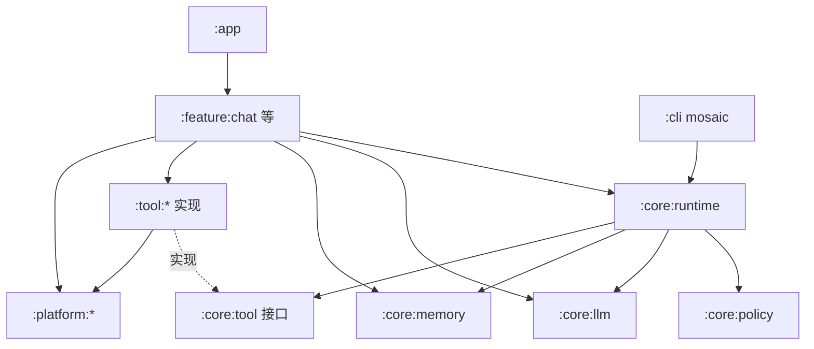

**依赖红线（落实 §17.2）**：

| 规则 | 约束 |
|---|---|
| JVM 纯净 | `:core:*` 不依赖 Android SDK(ADR 0005),可被 `:cli` 直接复用;`:core:runtime` 仅依赖 `:core:tool` **接口**,Tool 实现(`:tool:*`)与平台能力(`:platform:*`)由上层(`:app`/`:feature:*`)注入 |
| 单向 | `:feature:*` → `:core:*`;`:tool:*`(实现) → `:core:tool`(接口) → 被 `:core:runtime` 调用,接口与实现分离,禁止 `:core:*` 反向依赖 `:platform:*` |
| 平台隔离 | Android 专有(权限/Accessibility/MediaProjection)仅在 `:platform:*` |
| 复用 | `:cli` 仅复用 `:core:*`(§17.3);桌面端长期复用 `:core:*`(决策 #18) |

## 20.3 错误映射表

统一错误模型（§12）→ 用户可见自然语言 / 开发者错误码：

| 错误码(开发者) | 类型(§12) | 用户可见文案(UI) |
|---|---|---|
| LLM_TIMEOUT | LlmError.Timeout | 网络超时，请重试 |
| LLM_RATE_LIMIT | LlmError.RateLimit | 请求过于频繁，请稍后 |
| TOOL_PERMISSION_DENIED | ToolError.PermissionDenied | 未授权，已为你跳过该操作 |
| TOOL_TIMEOUT | ToolError.Timeout | 操作超时，请重试 |
| POLICY_HIGH_RISK_DENIED | PolicyError | 该操作需你确认后才执行 |
| EGRESS_BLOCKED | PolicyError | 当前为本地模式，已阻止数据出境 |
| MEMORY_LLM_CONFLICT | MemoryError | 发现记忆与本次指令冲突，请选择保留 |
| RUNTIME_MAX_LOOPS | RuntimeError | 任务步数超限，已给出部分结果 |

- 用户可见一律自然语言（§12）；结构化错误码进 Task History（§11.3）与日志（§13，脱敏 §9.3）。

## 20.4 关键数据流图

### LLM 调用链

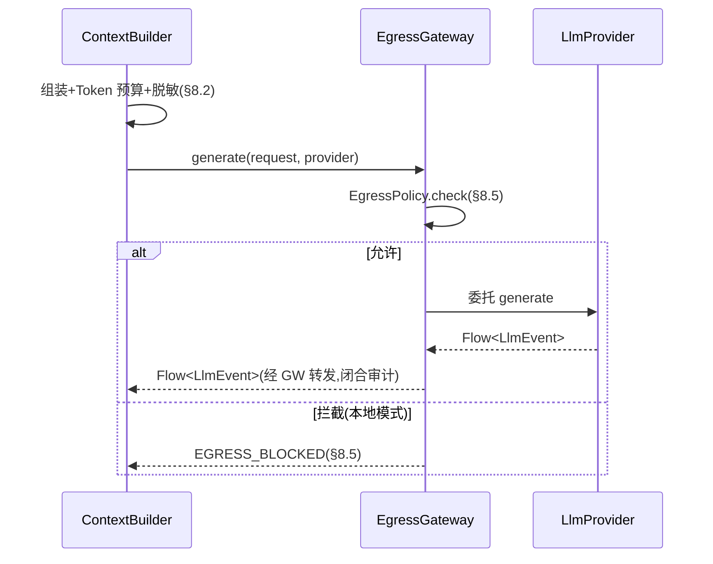

### Tool 执行链（Policy 校验）

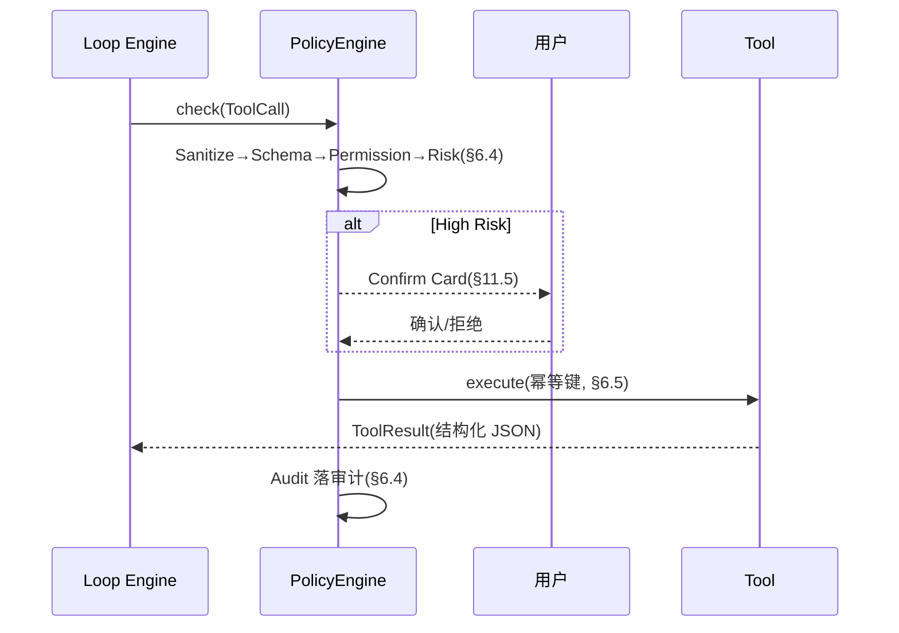

### Memory 写入（Memory Gate）

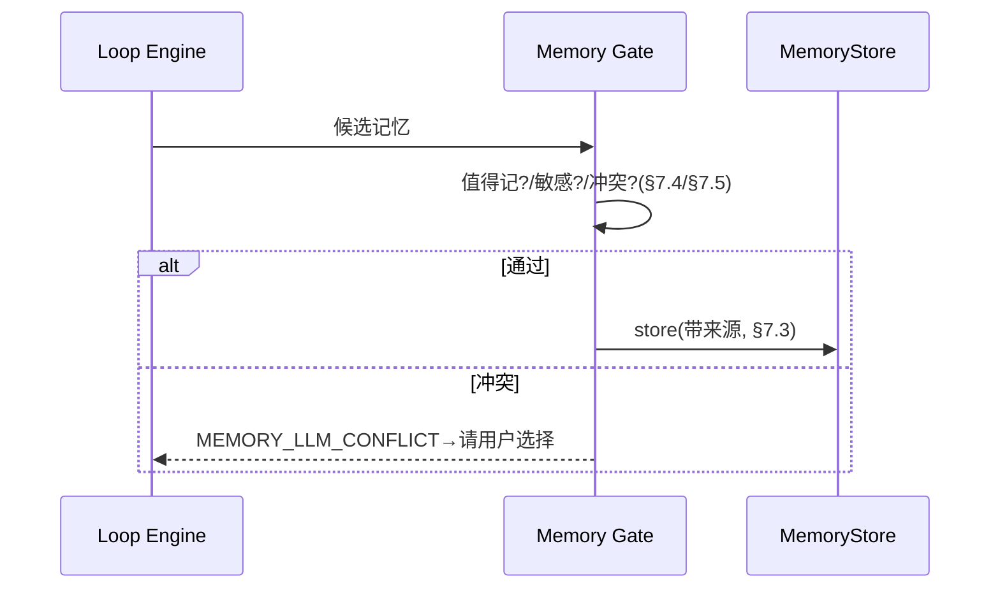

### 语音闭环（ASR/TTS）

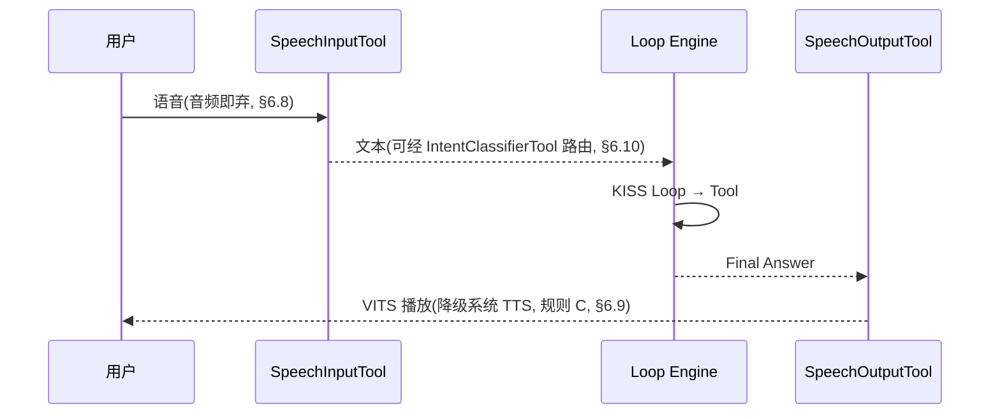

---

# 18. 风险矩阵

| 风险 | 等级 | 应对 |
|---|---|---|
| Android 后台限制 | 高 | MVP 不依赖长期后台运行 |
| Accessibility 不稳定 | 高 | Beta 能力；Play 审核要求提前知悉（§9.5） |
| Prompt Injection | 高 | Policy + Untrusted Data + ToolCallSanitizer |
| Cloud Privacy | 高 | Explicit Egress |
| Local LLM 性能 | 高 | MVP 后置 |
| Vector DB 兼容性 | 中 | MVP 用 FTS5 替代，VectorStore 抽象留接口（评审修正 #5） |
| Tool 重复执行 | 高 | Idempotency（Phase 1 起实现） |
| Memory 错误事实 | 中 | Confidence + Source |
| Context 超限 | 中 | Budget + Ranking + 本地 Token 估算 |
| LLM Tool Calling 幻觉 | 中 | ToolCallSanitizer（参数强转 + 默认值填充） |
| OEM 后台策略差异 | 中 | 20% 兼容性工期预算（§10.4） |
| ANR | 中 | 自定义 CoroutineDispatcher + UI 仅收集 StateFlow（§5.5） |
| 工期超预期 | 中 | 按 8–12 周规划，Phase 1 拆分子阶段逐级验证 |
| CLI 跨平台差异（JLine） | 低 | 仅影响开发工具，不影响产品交付；异常环境（Windows cmd / CI）降级为纯日志模式 |
| Play 政策限制 Accessibility 自动化 | 高 | `TapSwipeTool` 走 Beta/侧载变体；Play 版本仅保留感知能力（决策 #16） |
| 屏幕误识别导致错误操作 | 中 | 置信度阈值 + 高风险操作人工确认（`TapSwipeTool` 为 L3 每次确认） |
| 截图隐私泄露 | 中 | 本地处理、不进 Prompt、Sensitive 分类、日志禁记（§6.7） |
| OpenCV 包体积 | 低 | Phase 3 验证，必要时裁剪模块 |
| 厂商屏幕差异（分辨率/UI 定制） | 中 | 模板适配机制，计入 20% OEM 兼容预算（§10.4） |
| play 包残留侧载引导痕迹 | 高 | 零侧载引用红线 + CI 防泄漏校验 + 上架前对照最新 Play 政策（§9.5、§17.4） |
| 侧载包触发 Play Protect / OEM 安全提示 | 中 | 官网 FAQ + 签名校验指引；不绕过系统提示（§10.2） |
| 双渠道版本漂移 | 中 | 独立版本号与发布通道管理；共用 `:core:*` 单一代码源（§17.4） |
| 侧载分发链路劫持（恶意替换安装包） | 中 | 签名校验/哈希比对 + 自更新 HTTPS 证书固定 + 来源渠道标注（§17.4） |
| ASR 模型体积与 play 包按需下载 | 中 | 渠道区分部署：play 按需下载（进度/存储/流量提示）+ sideload 内置（§6.8） |
| ASR 效果不达验收标准 | 中 | SenseVoiceSmall 备选回退机制，两模型共用 Tool 接口切换（§6.8） |
| 录音隐私泄露 | 中 | 音频仅本地处理、不入 Prompt 全文/日志、Sensitive 分类（§6.8、§9.1） |
| TTS 模型体积（Kokoro 310MB）与选型 | 中 | VITS 系主选（~116MB）；Kokoro 需评估移动端 RTF 后再启用（§6.9） |
| 系统 TTS 跨设备不一致 | 低 | 仅作降级回退；主方案用 sherpa-onnx 离线模型保证一致性（§6.9） |
| 意图误判导致错误路由 | 中 | 置信度阈值回退 Cloud LLM + 向用户澄清，规则 E（§6.10） |
| 意图模型体积 | 低 | 编码器包约 10–20MB，独立可选下载，不计入语音预算（§6.10） |

---

# 19. 关键决策记录

## 19.1 V1.0 → V2.0 决策（6 项）

见 §1.4 演进记录表。

## 19.2 V2.0 → V2.1（本整合版）决策（13 项评审修正 + 9 项追加决策）

见 §1.4 演进记录表。要点：

- 工期基线采用评审重估（8–12 周），不采用 V2.0 隐含的 5–8 周。
- Semantic Memory MVP 采用 FTS5 + 关键词，向量检索与 Embedding 推迟到 Beta。
- 幂等键从 Phase 1 开始实现。
- Process Death Recovery 不承诺 LLM 流断点续传。
- 剪贴板 Tool 仅前台可用；Release 关闭 LLM 原始响应日志。
- Policy 链增加 ToolCallSanitizer 前置层。
- 新增 `:cli` 开发工具模块（决策 #14）：JVM-only，基于 mosaic 实现 Agent Console，复用 `:core:*` 并作为模块解耦验证；手机端"终端风"主题用 Compose UI 自绘，与 mosaic 无关。
- 引入屏幕感知能力（决策 #15）：MVP 仅感知（`ScreenCaptureTool` + `ScreenMatchTool`，Phase 3），`TapSwipeTool`（Accessibility 操作）Beta/侧载变体。
- 分发渠道默认 Play 合规路径（决策 #16）：MVP 仅感知能力；侧载变体承载 `TapSwipeTool`（该开放项已由决策 #17 关闭：双渠道启用，见 §17.4）。
- 构建期多渠道打包（决策 #17）：双渠道已确认启用——play 包（无 Accessibility）与 sideload 包（含 `TapSwipeTool`）；Gradle product flavors 构建期固化，运行时不做切换（§17.4）。
- 桌面端长期规划（决策 #18）：优先级后置于 Android 端与 `:cli` 稳定发布之后；复用 `:core:*` JVM 纯净架构，平台层届时新增（§15、§17.2）。
- 离线中文 ASR（决策 #19）：Paraformer-zh int8 主选 / SenseVoiceSmall 备选；play 包不内置模型按需下载，sideload 包内置模型（§6.8）。
- 离线 TTS（决策 #20）：sherpa-onnx VITS 系主选（`vits-zh-hf-fanchen-C`）/ Kokoro 备选；系统原生 TTS 仅降级回退；与 ASR 构成离线语音闭环（§6.9）。遗留待定项已规则化（§6.9 末节）：包体预算 ≤ 400MB（规则 A）、Kokoro 实机 RTF ≤ 1.0 门槛（规则 B）、系统 TTS 降级边界（规则 C）。
- 本地意图理解（决策 #21，V2.1.11）：`IntentClassifierTool` 主路径为中文编码器 ONNX + 微调分类头，复用 ONNX Runtime；规则 E（准确率 ≥ 90%、P95 ≤ 500ms）仍有效；SmolLM2 排除；Qwen3-0.6B / llama.cpp GGUF 降为历史方案；独立可选下载，不计入语音预算（§6.10）。
- 关键用户流程 / UI 规范 / 技术方案补全（决策 #22）：§4.4 六个端到端流程（UF-01–UF-06，Mermaid 图，映射 Case）、§11.4–§11.8 Material Design 3 完整设计规范、§20 接口契约级技术方案（5 接口契约 + 模块依赖图 + 错误映射 + 数据流）；配套 Case 13/14（E2E 共 14 个）与 2 项 DoD。

## 19.3 最终产品判断

原 V1.0 的方向是成立的，尤其是：

- Local-first
- KISS Loop
- Android Native Tool
- 三层 Memory
- Cloud/Local LLM Adapter
- Room + FTS5
- Compose
- Coroutine/Flow

这些可以作为产品核心。

但 V1.0 更接近"架构蓝图"，还不是严格意义上的"可执行 PRD"。

V2.0 的核心变化是把 Agent 从：

> "一个会调用 LLM 的 Android App"

提升为：

> "一个具有 Task、Policy、Tool、Memory、Recovery、Security 和 Observability 的本地 Agent Runtime"。

因此建议实际开发时严格采用：

**Phase 0 → Phase 1（1a → 1b）→ Phase 2 → Phase 3 → Phase 4**

而不是直接开发完整 Agent。

其中 **Phase 0 的 Fake LLM + Fake Tool + State Machine** 是整个项目最重要的技术验证点；如果这一层无法稳定运行，后续接入真实 LLM、Accessibility 和 Local Model 只会把问题复杂化。

---

## 附录 A：来源文件清单

| 文件 | 角色 |
|---|---|
| `source/Waku-Android_Local-First-Agent_PRD_v2.0.md` | 权威主干（V2.0.0） |
| `source/Waku-Android_PRD_V2.0_Feasibility_Review.md` | 可行性评审修正（B+） |
| `source/prd.md` | V1.0.0，仅作背景 |
